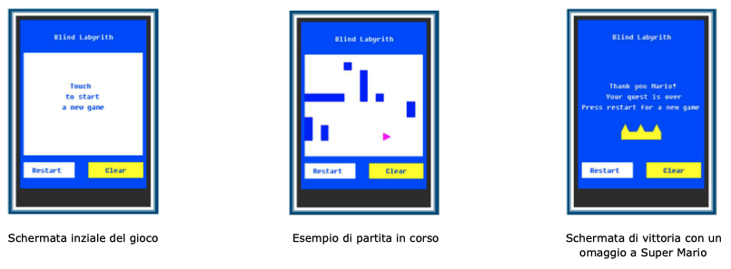

# Exam #2: "Blind Labyrinth "

## Architetture dei sistemi di elaborazione

### Regole del gioco

The joystick works in two modes that can be controlled by the SELECT button:
-	EXPLORE, where the robot cannot move, and the joystick is only used to select the robot direction. By acting on the UP/DOWN/LEFT/RIGHT directions, the robot is oriented to NORTH (N) / SOUTH (S) / WEST (W) / EAST (E), respectively.
-	MOVE, where the player can drive the robot in the four directions.

The touchscreen display shows the obstacles that have been detected by the robot’s proximity sensor in the current game. Moreover, the robot must be displayed using different colors (chosen by you) when the game is in EXPLORE mode or in MOVE mode (see Figure 2). Please note that obstacles must appear on the touchscreen in both EXPLORE and MOVE mode (if within the range of 5 slots).

The touchscreen is also used to make some actions:
- To start a new game, the user must touch the labyrinth area.
-	A RESTART button can be touched to quit the current game and to show the initial screen.
-	A CLEAR button can be touched to cancel all obstacles previously detected in the current game; the game continues, and the display will show new obstacles detected (including previous ones if detected again).

When the player reaches one of the exits, the game ends. To start a new game, the player must press the RESET button or touch RESTART on the screen. The joystick is disabled when the previous game ends and until the new game is started. When the game ends, an end-game message must be displayed on the touchscreen (up to you to design the message).

In both EXPLORE and MOVE modes, the proximity sensors (able to look up to 5 slots away from the robot) are active and can possibly detect obstacles along the direction in front of the robot.

The player can switch between EXPLORE and MOVE by pressing the SELECT. When a new game is started, the MOVE mode is selected by default. 

## Soluzione e commenti

Per lo svolgimento di questo progetto di Architetture dei sistemi di elaborazione, le librerie di maggior interesse sono quelle che gestiscono il RIT, la stampa sul display ed i timer. Vedremo di seguito le loro principali caratteristiche.

### Descrizione librerie
- Libreria RIT: Il “Ripetitive Interrupt Timer” viene utilizzato per implementare le funzionalità di polling del joystick: ogni 50ms il RIT triggera un interrupt per controllare se è avvenuta la pressione di uno dei cinque tasti a nostra disposizione, ovvero SELECT, UP, DOWN, RIGHT e LEFT. Per permetterlo, viene letto il valore della porta GPIO1 al bit corrispondente di ciascun tasto, attivo basso. In particolare, per gestire la pressione di UP, DOWN, RIGHT o LEFT nel file “IRQ_RIT.c” incremento e tengo conto di una variabile che mi permette di muoverlo solo per i multipli di 20 della stessa, quindi ogni 20*50ms=1s, evitando così di utilizzare un timer extra per il movimento. Se in modalità EXPLORE, si controlla la presenza degli ostacoli nelle caselle di fronte al robot e, se non sono stati trovati in precedenza, si aggiorna una matrice che ne tiene conto e lo si stampa a schermo. Ho scelto di salvare la posizione degli ostacoli sia per non dover stampare nuovamente un ostacolo già trovato sia perché se viene richiesto un CLEAR è più veloce cancellare i singoli ostacoli trovati che tutto lo schermo. Le stesse funzioni sono utilizzate per la modalità MOVE, in cui in più se possibile viene mosso il robot e per ciascuna casella in cui finisce si controlla che non sia un’uscita. Se essa viene rilevata viene chiamata la funzione che si occupa di mostrare la schermata di vittoria.

- Libreria DISPLAY: La seguente libreria, con le funzioni presenti in “display.c”, si occupa della stampa su schermo degli elementi grafici. Fanno parte di questa libreria le funzioni che permettono di disegnare gli ostacoli, ovvero quadrati 15x15 px, di cancellarli, di disegnare il robot in verde o in magenta in base alla direzione guardata e quelle per mostrare e cancellare la scritta iniziale. Include anche la funzione “inizializza_interfaccia” che si occupa di inizializzare le componenti grafiche all’avvio del gioco, tra cui lo sfondo blu, i tasti con le loro scritte ed il quadrato bianco che funge come rappresentazione grafica del labirinto. Infine, gestisce la funzione che stampa la schermata di vittoria.

- Libreria TIMER: In “IRQ_timer.c”, nella funzione dedicata alla gestione del timer0, che è l’unico timer utilizzato, gestisco l’interazione con i tre punti del touchscreen richiesti. All’inizio del gioco il codice contenuto in questa libreria permette di cliccare su “Touch to start a new game” per iniziare a giocare. Toccato, viene quindi rimossa la scritta preliminare ed inizializzato il labirinto con il robot in posizione di partenza. Pone quindi il flag “start=1”, che abilita l’utilizzo degli altri due pulsanti touch. Il primo è il pulsante a schermo RESTART: alla pressione rimuove tutti gli ostacoli trovati dalla matrice che li memorizzava, stampandoci sopra il loro corrispettivo bianco per nasconderli, inizializza il robot in posizione di partenza e stampa infine la scritta iniziale. Se viene invece rilevata la variabile globale “win=1”, che viene settata dopo una vittoria e quindi indica che l’utente vuole giocare una nuova partita, verrà mostrata la schermata iniziale e saranno chiamate le stesse funzioni descritte in precedenza. Il secondo è il pulsante CLEAR, anch’esso è abilitato solo se “start=1”, quindi quando il gioco è già stato inizializzato, e permette di cancellare tutti gli ostacoli che erano stati precedentemente salvati nella matrice descritta, per poi nasconderli a schermo. Quindi in base alla posizione del robot in cui viene chiamata, controlla se c’è un ostacolo che deve essere nuovamente mostrato.

## Screenshot

